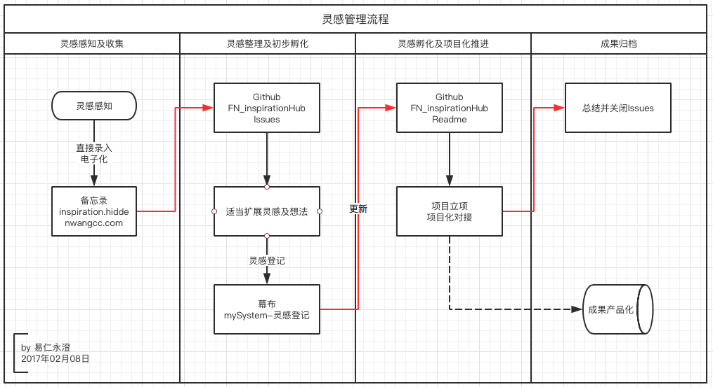

# 易仁永澄灵感孵化器

为了将脑海中的灵感随时收集并进行酝酿，特设定本Repo，并安排规则启动灵感收集及酝酿过程。

## 一、灵感管理流程

整个灵感管理主要分为四个步骤：

1. 灵感感知及收集
2. 灵感整理及初步孵化
3. 灵感孵化及项目化推进
4. 成果归档

具体流程见：

## 二、灵感管理原则
（本部分内容持续更新）

1. 同时推进的灵感孵化不得超过3个
2. 每天都要将新产生的灵感归档

## 三、目前正在推进的灵感

1. 每天回顾整理的内容

- - - - -
#### changelog

- 功能启动日期：2017年02月08日

